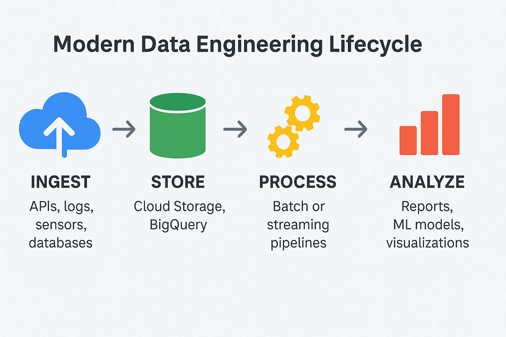
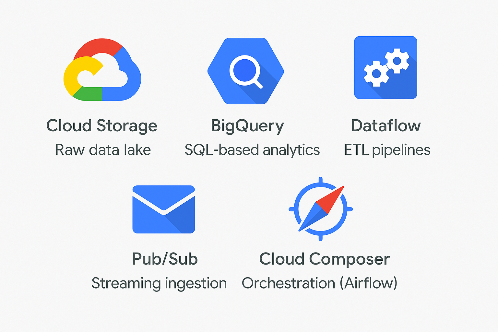

## What is Data Engineering?

> Ingest → Store → Process → Analyze  
> Each step transforms raw data into meaningful insights.

### The foundation of modern data systems:
- Ingest data from various sources
- Store in scalable data lakes or warehouses
- Process via batch/streaming pipelines
- Enable analytics, reporting, ML

---

## Role of Cloud in Data Engineering

### Why cloud-native?
- Elastic scalability
- Fully managed services
- Pay-as-you-go pricing
- Integration with modern tools (AI/ML, BI)

---

## GCP's Place in the Ecosystem

Google Cloud offers:
- Serverless data services
- Powerful analytics tools (e.g., BigQuery)
- Orchestration with Cloud Composer (Airflow)
- Global scale and security

---

## GCP Services for Data Engineering

> From raw storage to orchestration — here’s your toolset.

| Service | Purpose |
|----------------|------------------------------------|
| Cloud Storage | Data lake / raw data storage |
| BigQuery | Serverless data warehouse |
| Dataflow | Batch and streaming processing |
| Pub/Sub | Event ingestion and streaming |
| Cloud Composer | Pipeline orchestration (Airflow) |

---

## Real-World Use Cases

- Retail: Real-time recommendation systems
- Healthcare: Secure patient data pipelines
- Finance: Fraud detection using streaming
- Media: Content consumption analytics

---

## Why Learn Data Engineering on GCP?

- High demand for cloud data engineers
- GCP is widely used in startups and enterprises
- Certification-ready skills (e.g., Professional Data Engineer)
- Build portfolio-worthy projects

---

## What’s Next?

👉 Setting Up Your GCP Account and Billing