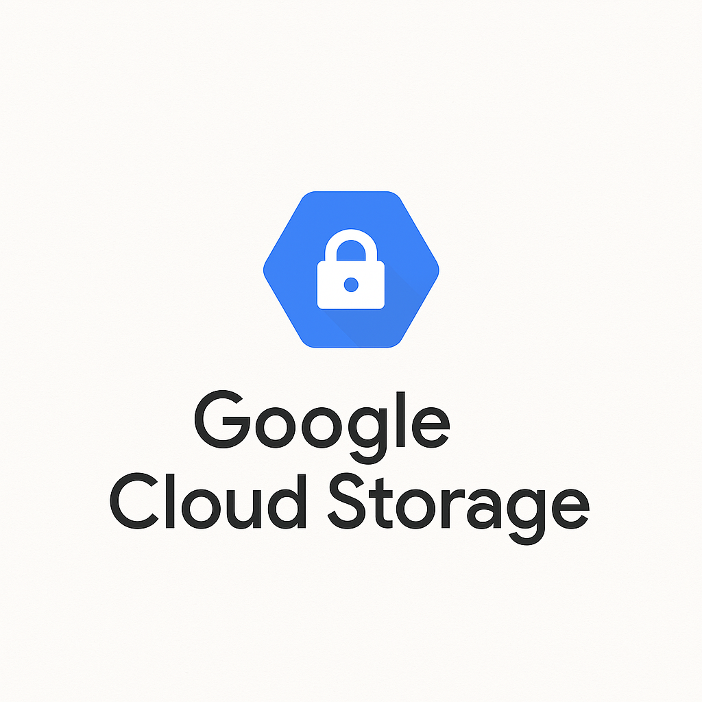
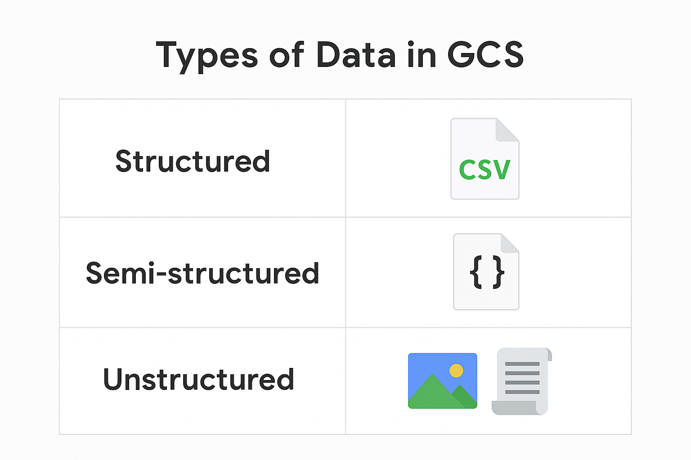
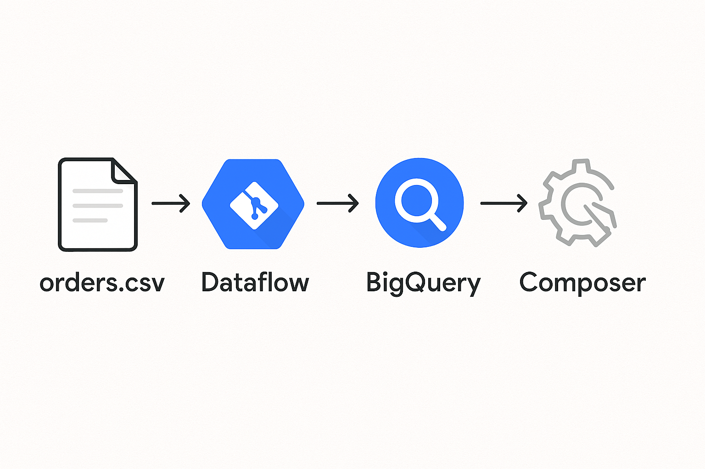

## Welcome to Module 2

  
  

    <ul>
      <li>Foundation for scalable, secure data lakes</li>
      <li>Supports all types of data: structured, semi-structured, unstructured</li>
      <li>Powers modern analytics and ML workloads</li>
    </ul>
  

---

## What is Google Cloud Storage?

- Object storage service on GCP
- Virtually unlimited scale
- Pay-as-you-go pricing
- Designed for reliability, performance, and global accessibility

---

## Key Features of GCS

- ✅ Managed and serverless
- ✅ Support for multiple storage classes
- ✅ Data versioning and lifecycle policies
- ✅ IAM and uniform bucket-level access
- ✅ Integration with GCP services (BigQuery, Dataflow, Composer)

---

## Types of Data in GCS

| Type | Example Files |
|------------------|-----------------------|
| Structured | CSV, Parquet |
| Semi-Structured | JSON, JSONL, Avro |
| Unstructured | Images, logs, text |

> "GCS is schema-less — you store anything you want."

---

## GCS for Data Engineering

- Acts as **landing/staging zone** in data pipelines
- Ingest data from batch & real-time sources
- Feeds data into BigQuery, Dataflow, AI/ML models
- Used for backups, archival, and more

---

## Use Cases

- 🚚 Data ingestion layer for ETL pipelines
- 🧠 Source for BigQuery analytics and ML training
- 🏥 IoT sensor and health device data collection
- 🧾 Logging and monitoring centralization
- 🧊 Archival and compliance storage

---

## Real-World Example

Imagine you're building a sales analytics pipeline:

1. Upload **orders.csv** to GCS
2. Process with **Dataflow**
3. Load into **BigQuery**
4. Schedule with **Cloud Composer**

GCS is the **first stop** in the pipeline.

---

## What’s Next?

👉 Explore GCS structure: **buckets, objects, storage classes**  
👉 Create your first bucket using the CLI